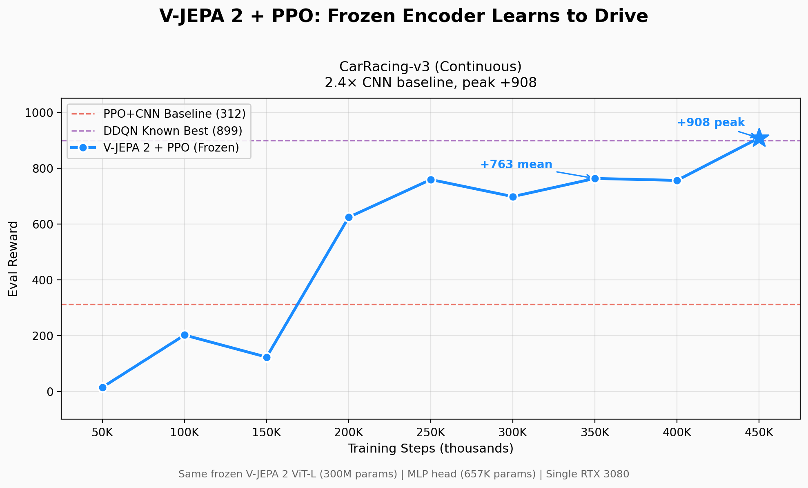

# Frozen Video Encoders for Control: V-JEPA 2 on CarRacing-v3

A fully frozen 300M-parameter V-JEPA 2 video encoder, paired with a 657K-parameter PPO policy head, reached **+763 mean eval reward** on `CarRacing-v3` on a single NVIDIA RTX 3080.

**Full write-up:** [I Froze a 300M-Parameter Video Model and It Learned to Drive](https://daveleongai.substack.com/p/i-froze-a-300m-parameter-video-model) (Substack)

This public repository is a **results artifact** for the article above. It contains the headline benchmark summary, learning-curve asset, code, and proof bundle for public review.



## At A Glance

- **Environment:** `CarRacing-v3`
- **Frozen encoder:** Meta V-JEPA 2 ViT-L (`facebook/vjepa2-vitl-fpc64-256`)
- **Trainable head:** 657K-parameter PPO policy head
- **Training budget:** 400K steps
- **Hardware:** single NVIDIA RTX 3080 (10GB)
- **Result:** **+763 mean eval reward**, **+908 peak episode**
- **Reference baseline:** PPO + CNN trained from scratch = **+312**

The encoder stayed frozen throughout training. Only the downstream policy head learned.

## Benchmark Summary

| Metric | Value |
|---|---:|
| Mean eval reward | **+763** |
| Peak episode | **+908** |
| Scratch CNN baseline | +312 |
| Improvement vs scratch CNN | **2.4x** |
| Best mean checkpoint | 350K steps |

## Experimental Setup

```text
RGB Frames (2-frame buffer, 96x96)
    ↓
V-JEPA 2 ViT-L (300M params, FROZEN)
facebook/vjepa2-vitl-fpc64-256
    ↓
1024-dimensional embeddings
    ↓
MLP Policy Head (657K params, TRAINED)
1024 -> 512 -> 256 -> 3
    ↓
Continuous Actions [steer, gas, brake]
```

Key details:

- PPO via Stable-Baselines3
- Frame buffer = 2
- Frame skip = 4
- 400K total training steps
- Single RTX 3080 (10GB)

## Repository Contents

- `src/` — training and evaluation code for the JEPA + PPO result
- `pyproject.toml` and `uv.lock` — reproducible Python environment
- `proof/` — run configs, evaluation traces, training logs, and saved checkpoints for the 350K best mean and the 400K final plateau
- `assets/` — learning curve chart and one-page results brief

For the proof verification path, see [proof/PROOF.md](proof/PROOF.md).

## Caveats

- This is one environment and one main seed.
- The result shows strong representation transfer for control, not broad generalization.
- Peak episode and mean eval reward are reported separately and should not be treated as interchangeable metrics.

## Next Experiments

- run the same frozen-encoder setup on a second environment
- compare V-JEPA 2 against other frozen encoders under controlled settings
- expand the public artifact set with additional benchmark summaries

## How To Verify

```bash
uv sync --frozen
uv run python -m src.eval_jepa_ppo \
  --model_path "proof/runs/jepa_ppo_resume_300k/best_model.zip" \
  --episodes 5 \
  --device auto
```

That command evaluates the saved best checkpoint from the resumed run. The matching config lives beside the checkpoint, so the evaluator will reuse the recorded `frame_skip=4` and `buffer_size=2` settings automatically.

For a one-command setup and smoke test, you can also run:

```bash
bash scripts/setup.sh
```

For the exact learning-curve milestones used in the article, see:

- [proof/PROOF.md](proof/PROOF.md)
- [proof/carracing_eval_curve.csv](proof/carracing_eval_curve.csv)

## Results Brief

See [VJEPA2-RL-Results-Brief.pdf](assets/VJEPA2-RL-Results-Brief.pdf) for the one-page technical summary.

## Contact

Dave Leong - dl@daveleong.com - [LinkedIn](https://linkedin.com/in/daveleongsingapore) - [Substack](https://daveleongai.substack.com)
